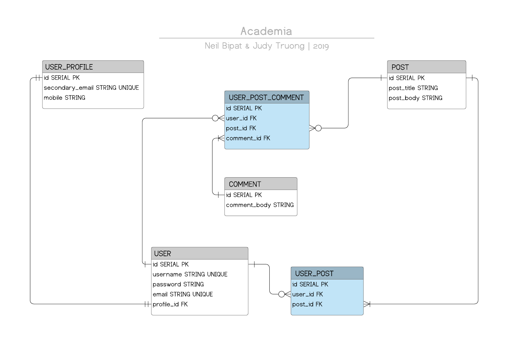

# Academia
A Full Stack Reddit Clone Focused On <a href = "https://en.wikipedia.org/wiki/My_Hero_Academia"> My Hero Academia </a>.

### Academia Colleagues 
- <a href = "https://github.com/neilbipat">Neil Bipat</a>
- <a href="https://https://github.com/judycodes">Judy Truong</a>

### Technologies

_Frontend_
- HTML
- CSS
- Javascript

_Backend_ 
- Java (Spring Boot)
- PostgreSQL

### Application Approach & Process

|                    Day 1                    	|                        Day 2                        	| Day 3 	| Day 4 	| Day 5 	| Day 6 	|
|:-------------------------------------------:	|:---------------------------------------------------:	|:-----:	|:-----:	|:-----:	|:-----:	|
|              Spring Boot Setup              	|           Login Endpoint and Functionality          	|       	|       	|       	|       	|
|      Brainstorm: ERD Design, Endpoints      	| User_Profile Model, Service, Repository, Controller 	|       	|       	|       	|       	|
| User Model, Service, Repository, Controller 	|    Create User_Profile Endpoint and Functionality   	|       	|       	|       	|       	|
|      Signup Endpoint and Functionality      	|    Entity Relationship Diagram (ERD) and Readme     	|       	|       	|       	|       	|
        
#### Academia Entity Relationship Diagram

#### API & Database Structure
##### _Models & Tables Information_ 
- Academia's database has four data models: `User`,`User_Profile`, `Post`, & `Comment`.
- The `User` and `Post` models form a JOIN TABLE for posts related to that user account. 
- The `User` and `Comment` models form a JOIN TABLE for comments related to that user account.

##### _Relationships_
- A `User` has one and only one `User_Profile` and a `User_Profile` is associated to one and only one `User`. 
- A `User` can have zero to many posts.
- A `User` can have zero to many comments.
- Each `Post` can have zero to many comments.
- Each `Comment` is associated to one post. 
- Each `Post` and `Comment` is linked to one `User`.

#### Wireframes
   
### Completions

### Challenges/Obstacles/Roadblocks

### Installation Instructions

### User Stories
