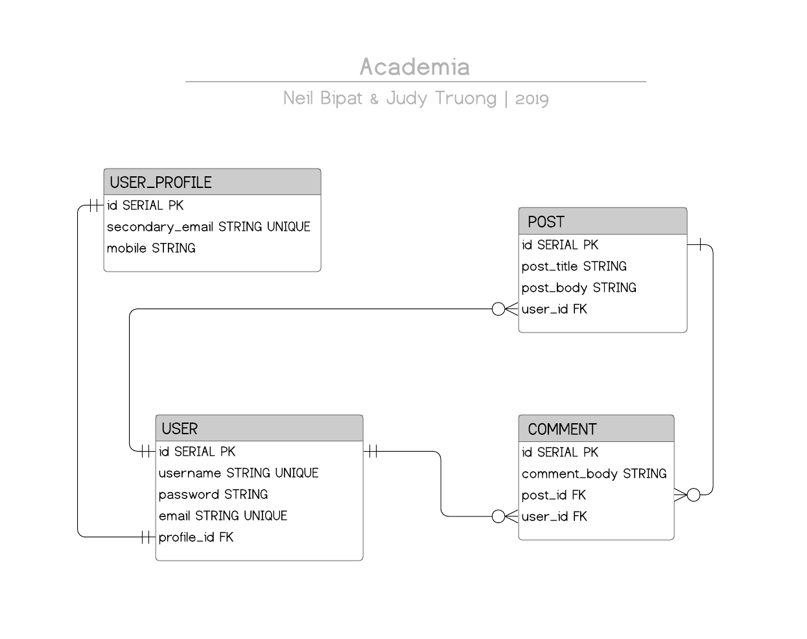

# Academia
A Full Stack Reddit Clone Focused On <a href = "https://en.wikipedia.org/wiki/My_Hero_Academia"> My Hero Academia </a>.

### Academia Colleagues 
- <a href = "https://github.com/neilbipat">Neil Bipat</a>
- <a href="https://https://github.com/judycodes">Judy Truong</a>

### Technologies

_Frontend_
- HTML
- CSS
- Javascript

_Backend_ 
- Java (Spring Boot)
- PostgreSQL

### Application Approach & Process
| Day 1                                       | Day 2                                               | Day 3                                                                   | Day 4                                                    | Day 5                                                               | Day 6                                                                                                                           | Day 7                                                                                                                                      | Day 8 |
|---------------------------------------------|-----------------------------------------------------|-------------------------------------------------------------------------|----------------------------------------------------------|---------------------------------------------------------------------|---------------------------------------------------------------------------------------------------------------------------------|--------------------------------------------------------------------------------------------------------------------------------------------|-------|
| Spring Boot Setup                           | Login Endpoint and Functionality                    | Post and Comment functionality (Create, List, Delete) linked to User_id | UserController, UserProfileService, PostService Testing  | Minor code cleanup                                                  | Fixed CORS errors                                                                                                               | Frontend features: Delete comment buttons functional, Display user profile, Display only user posts and only user comments on user profile |       |
| Brainstorm: ERD Design, Endpoints           | User_Profile Model, Service, Repository, Controller | Join columns in Comment, Post, User models                              | Added IAuthenticationFacade To Check Authenticated Users | Frontend Files Setup                                                | Backend to Frontend functionality: list all posts, delete only user posts, create a post, display comments, create user profile | Backend to Frontend functionality: Delete only user comments and posts, Show user posts and user comments on button click in user profile  |       |
| User Model, Service, Repository, Controller | Create User_Profile Endpoint and Functionality      | Testing Setup                                                           | Fixed minor errors with nonexistent/deleted posts        | Wireframe and Frontend design Brainstorm                            | Frontend profile page designed                                                                                                  | Error handling for empty input submissions                                                                                                 |       |
| Signup Endpoint and Functionality           | Entity Relationship Diagram (ERD) and Readme        | Updated ERD                                                             | Minor code cleanup                                       | Login & Signup Frontend to Backend Connection, Logout functionality | Front end features: View comments & Delete post buttons functional                                                              | Created user stories                                                                                                                       |       |

#### Academia Entity Relationship Diagram

#### API & Database Structure
##### _Models & Tables Information_ 
- Academia's database has four data models: `User`,`User_Profile`, `Post`, & `Comment`.
- The `Post` model has `user_id` as a foreign key for posts related to that user account. 
- The `Comment` model has `user_id` and `post_id` as foreign keys related to specified posts and for specified user accounts.

##### _Relationships_
- A `User` has one and only one `User_Profile` and a `User_Profile` is associated to one and only one `User`. 
- A `User` can have zero to many posts.
- A `User` can have zero to many comments.
- Each `Post` can have zero to many comments.
- Each `Comment` is associated to one post. 
- Each `Post` and `Comment` is linked to one `User`.

#### Wireframes
   
### Completions
Working Functions
- Signup
- Login
- Create user profile
- Display user profile
- Update user profile
- List all posts
- List all comments for a post
- List only user's posts
- List only user's comments
- Create comment
- Create post
- Delete post
- Delete comment

Available in Backend But Not Used in Frontend
- List all users
- Get specific post
- Get specific comment

Unit Testing
- User Service
- User Controller
- User Profile Controller
- Post Controller 

Exception Handling
- Posts and Comments by a user can only be deleted by that user

### Challenges/Obstacles/Roadblocks
- Understanding Unit Testing (beyond signup and login)
- CORS issues
- @JsonIdentityInfo causing unexpected issues
- Connecting backend to frontend

### Installation Instructions
Dependencies Needed:
- PostgreSQL
- Spring Boot JDBC
- Spring Boot JPA
- Spring Boot Security
- Spring Boot Web
- Spring Boot DevTools
- Json Web Token

### User Stories
1. New user can create an account and enter the homepage to access MHA features. 
- New user inputs username, email, and password. A token is returned and associated with the new user. With the token, new user gains access to the website. 
- If parameters are unfulfilled or an error, an alert appears informing the user and the user can return to the landing page to complete the account registration process. If an error occurs in the signup process, the user is not redirected to the homepage. 

2. Returning user can log in with his/her username and password in order to enter the homepage to access MHA features. 
- Returning user logs in with username and password. A token is returned associated with the returning user. 
- If an error occurs with the login process, the user is informed and can try logging in again. If an error occurs in the login process, the user is not redirected to the homepage. 

3. A logged in user is able to create a user profile associated with his/her account. The user can input mobile and secondary email information for display in the user profile page. The primary email address and username entered when signing up for an account should already be on display on the user profile page. 
- Logged in user must provide secondary email address and mobile number for a user profile to be created. If those fields are not given, an alert will occur.  
